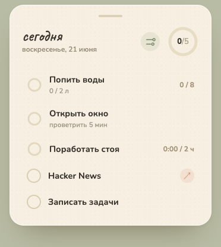

# welldget — Wellness Widget

A small macOS desktop widget that floats in the corner of your screen: a daily
wellness checklist with counters, timers, countdowns (incl. a "window airing"
mode) and check-off tasks. State is kept in `localStorage` and resets each day.

<p align="center">
  
</p>

Imported from the Claude Design prototype `Wellness Widget.dc.html` and wrapped
in a frameless, transparent, always-on-top **Electron** window pinned to the
top-right corner.

## Run it

```bash
npm install
npm run app          # builds the UI and opens the floating widget
```

The widget appears in a screen corner (top-right by default), lives in the
**menu bar** (no Dock icon), and floats above other windows. The window
auto-sizes to the card's height.

- **Move it:** drag by the grip strip at the top of the card.
- **Pick a corner:** Settings (⚙) → «где показывать» (top/bottom · left/right),
  or the menu-bar icon → «Где показывать». The choice is remembered.
- **Show / hide:** click the menu-bar icon.
- **Quit:** menu-bar icon → «Выход» (or ⌘Q while focused).

### Icons

`npm run icons` regenerates `build/icon.png` and the menu-bar template from
`scripts/gen-icon.cjs` (a sage rounded square with a cream ring + checkmark).
The `.icns` is built from that PNG with `sips` + `iconutil`.

`npm run screenshot` regenerates `build/screenshot.png` (the image above) by
rendering the widget in a headless Electron window and cropping to the card.

### Live development

```bash
npm run dev          # terminal 1 — Vite dev server on :5173
npm run app:dev      # terminal 2 — Electron pointed at the dev server (hot reload)
```

### Web preview (optional)

The UI also runs as a plain web page (full-screen beige background instead of
the floating card):

```bash
npm run dev          # open the printed http://localhost:5173 URL
```

## Packaging a standalone `.app`

```bash
npm run dist         # → release/mac-arm64/welldget.app
```

> **Note on signing:** the produced `.app` runs only after it is code-signed.
> Ad-hoc signing is rejected by macOS AMFI for Electron's JIT, so to get a
> double-clickable, distributable app you need an Apple **Developer ID**
> certificate. Set it in the `build.mac` config (electron-builder) and re-run
> `npm run dist`. For day-to-day personal use, `npm run app` is the simplest
> way to launch the widget.

## Layout

| Path | What |
|------|------|
| `src/WellnessWidget.jsx` | The widget UI + all task logic (React) |
| `src/main.jsx`, `src/index.css` | React entry + keyframes |
| `electron/main.cjs` | Frameless transparent corner window + menu-bar tray |
| `index.html` | Fonts (Nunito + Caveat) and root |
| `build/entitlements.mac.plist` | macOS JIT entitlements for signing |
